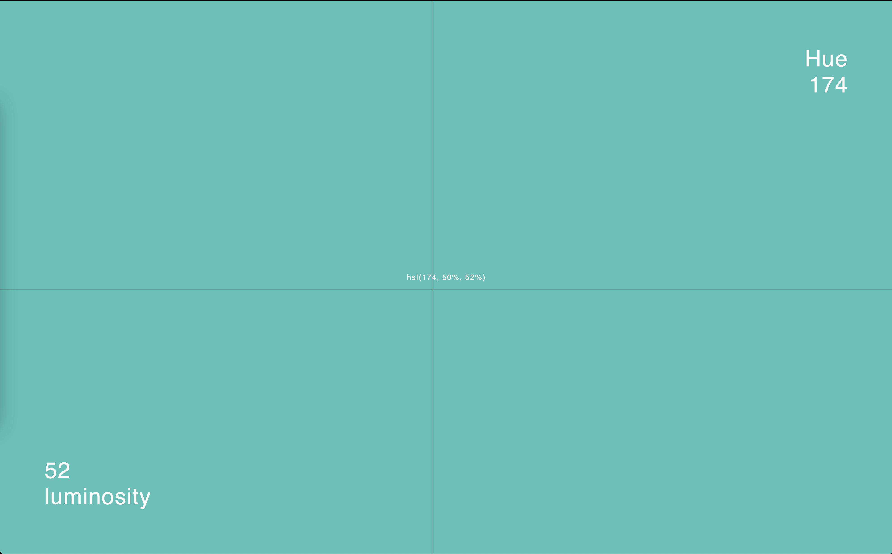
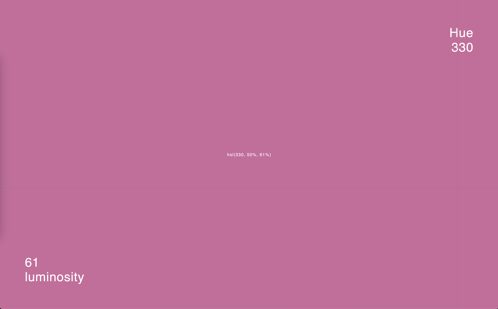
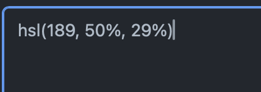

# Pick Color
a simple javascript project to help you choose colors
it will change the entire background to the selected color as you move your mouse around

you can try a live version [here](https://hassanalikadhem.github.io/pick-and-click.html)

moving your mouse verticly changes luminosity and moving horizontally changes the hue

if you click you left mouse button the current color will be copied to you clipboard in the hsl format

